# ARCHITECTURE.md: Halfsies

Version: 1.0.0-draft
Status: Draft for review
Scope: How the Halfsies iOS app, Android app, and API are built and run: components, interfaces, data flow, trust boundaries, technology choices, and the reasons for them.
Companion docs: `REQUIREMENTS.md` (what the system must do), `DESIGN.md` (UI rules), `SECURITY.md` (to be written), `DEPENDENCIES.md` (to be written)

`REQUIREMENTS.md` is the source of truth for scope. This file never adds features. When it names a requirement ID, it is describing how that requirement is met. Rule keywords follow RFC 2119. Architecture decisions have stable IDs (`AD-*`) and open architecture questions have `AQ-*` IDs. `TO BE DECIDED` marks a choice that has not been made yet.

---

## 1. Drivers and constraints

### 1.1 Fixed constraints

These were decided by the project owner and are not revisited here.

| Constraint | Choice |
|---|---|
| Mobile client | React Native, one codebase for iOS and Android |
| Server | Node.js |
| Database | PostgreSQL (relational) |
| Cloud | AWS |
| Scale | Large user base. Use standard, widely adopted components; nothing exotic |

### 1.2 Quality attributes that shape the design

| Attribute | Source | Architectural consequence |
|---|---|---|
| Location privacy | PRIV-01 to PRIV-06, API-SHP-01 | Precise origins are encrypted with a dedicated KMS key, snapped before they leave the server, kept out of every log path, and purged on a schedule |
| Provider cost | NFR-COST-01 to 03, FR-SRCH-11 | The server proxies every place and routing call. It enforces a candidate cap, per-user and global budgets, and search result reuse |
| Search latency | NFR-PERF-01 | Candidate generation takes a bounded number of provider round trips, and independent calls run in parallel |
| Availability | NFR-AV-01 (99.5%) | One region with three Availability Zones. Every tier is stateless or managed Multi-AZ |
| Security baseline | Section 7 | Token service in the API, DPoP, a single authorization layer, schema validation at the edge of the application |
| Swappable providers | INT-03 | Providers sit behind internal TypeScript interfaces |

### 1.3 Planning assumptions

These numbers size the first production deployment. They are assumptions, not requirements. Every tier scales horizontally past them.

| Metric | Assumption |
|---|---|
| Registered accounts | 5 million |
| Daily active users | 500,000 |
| Peak API requests | 2,000 per second |
| Peak searches (cache misses) | 50 per second |
| Concurrently open sessions | 250,000 |

Most data is short-lived. Sessions expire within 7 days and their location data is purged (section 6.3 of `REQUIREMENTS.md`). The hot tables therefore stay small no matter how many users sign up. The real scaling limits are provider quotas and provider spend, not the database.

### 1.4 Open decisions this document closes or proposes to close

| Open decision | Resolution here | Status |
|---|---|---|
| OD-01 Native or cross-platform | React Native (AD-01) | Closed by project owner |
| OD-02 Routing provider, transit in v1 | Google Routes API, transit in v1 (AD-10) | Proposed; Product must confirm the cost |
| OD-03 Places provider and caching limits | Google Places API (New) (AD-10). Retention is in section 10.3 | Proposed; Legal must confirm the retention table |
| OD-04 DPoP in v1 | Ship DPoP in v1 (AD-14) | Proposed; Security owns the decision |
| OD-06 Rounding of travel times | Round both displayed times to the nearest minute (AD-17) | Proposed; Security and Product own the decision |
| OD-07 Hosting region and cloud | AWS, `us-west-2` primary (AD-20) | Cloud closed by project owner; region proposed |

---

## 2. System context

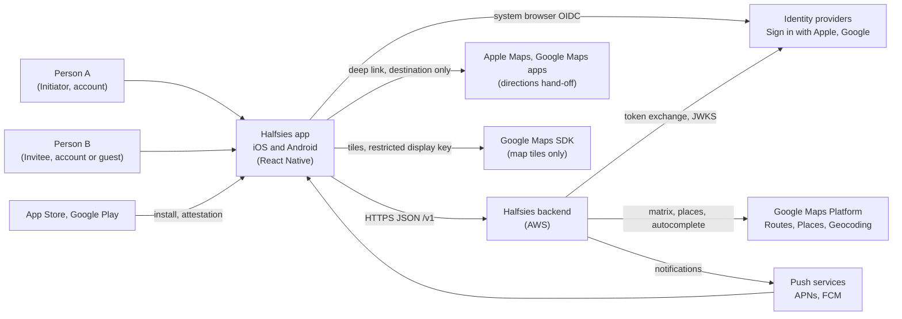

The app talks to exactly one backend, the Halfsies API (PLAT-05). The only third-party calls the app makes directly are: the OIDC authorization request in the system browser, map tile rendering through the map SDK (SEC-SEC-02), and the directions hand-off to a maps app (FR-RES-06).

---

## 3. Containers

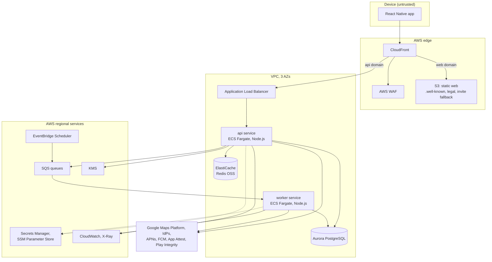

| Container | Responsibility | Technology |
|---|---|---|
| Mobile app | UI, OIDC sign-in, secure token storage, DPoP signing, app attestation, deep links, offline read-only cache | React Native, TypeScript, Hermes (section 4) |
| Edge | TLS termination, HSTS, DDoS protection, coarse per-IP rate limits, static web content (INT-06) | CloudFront, AWS WAF, AWS Shield Standard, S3 |
| api service | The `/v1` HTTP API. Authentication, authorization, validation, search orchestration, response shaping | Node.js 24 LTS, TypeScript, Fastify (section 5) |
| worker service | Outbox relay, push delivery, retention purges, account deletion completion, session-ending reminders | Same codebase as the API, different entry point (section 6) |
| Aurora PostgreSQL | System of record | Aurora PostgreSQL 17-compatible, Multi-AZ (section 7) |
| ElastiCache | Rate-limit counters, DPoP replay cache, token denylist, provider budget counters | ElastiCache, Redis OSS engine, cluster mode, Multi-AZ |
| SQS | Asynchronous work and retries | Standard queues, each with a dead-letter queue |
| KMS | Origin encryption key (PRIV-04) and at-rest keys for every data store | Customer managed keys |

---

## 4. Mobile app architecture

### 4.1 Framework and runtime

- AD-01: The app is **React Native with TypeScript** (strict mode), using the New Architecture and the Hermes engine. This closes OD-01 and satisfies PLAT-03: every screen is a native view, and no application screen uses a WebView.
- AD-02: The project uses **Expo modules with Continuous Native Generation (`expo prebuild`)**. That is the framework path the React Native documentation recommends. Native projects are generated in CI and built by our own pipeline (SEC-SC-04). Expo Go and hosted Expo build services are not used for release builds.
- AD-03: **Over-the-air JavaScript updates are disabled** in v1. Every code change ships through a signed store build. This keeps one release path for the supply chain controls in section 7.10 of `REQUIREMENTS.md` and for store review.

### 4.2 Layers

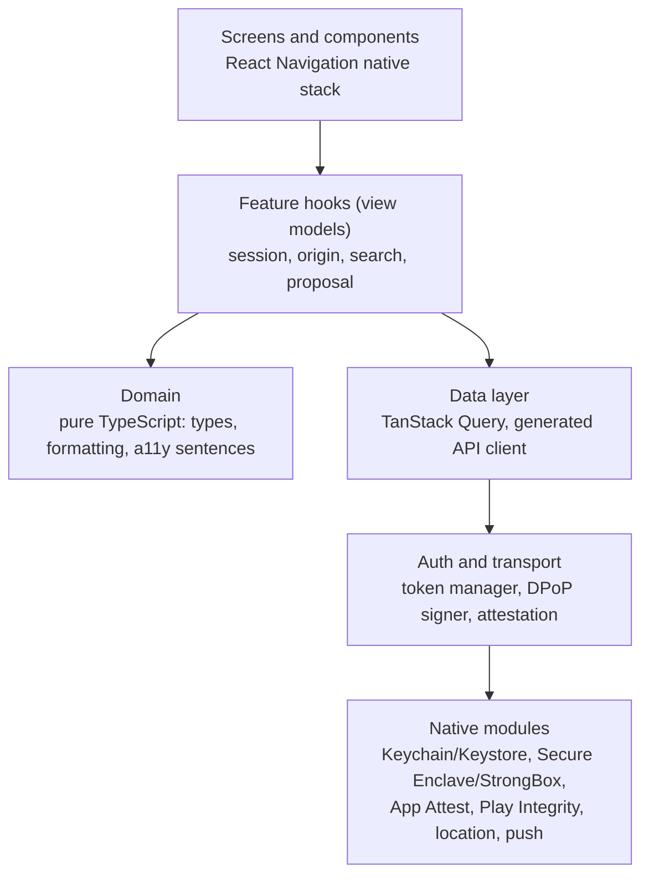

| Layer | Contents | Rules |
|---|---|---|
| Screens | React Navigation (native stack) screens and the `DESIGN.md` components | No direct network calls. They render only what the API returns. For example, the Even trip badge comes from the API's `even` flag and is never recomputed (`DESIGN.md` R-2) |
| Feature hooks | One hook module per feature, holding view state and actions | Unit tested (QA-01) |
| Domain | Travel pair sentence builder (`DESIGN.md` A-4), unit and time formatting (NFR-L10N-02) | No I/O |
| Data | API client generated from `packages/api-contract/openapi.yaml` with `openapi-typescript` and `openapi-fetch`. TanStack Query holds server state | Requests carry `X-App-Version` and `X-Platform` (API-07) |
| Auth and transport | Token manager (single-flight refresh), DPoP proof signer, attestation helper, `426` handler that shows the update prompt | The only code that reads credentials |
| Native modules | See section 4.3 | Kept small and audited |

### 4.3 Libraries

Every library below still needs its `DEPENDENCIES.md` review before adoption (SEC-SC-01).

| Need | Library | Notes |
|---|---|---|
| Navigation | `@react-navigation/native-stack` | Native screen containers |
| Server state and offline cache | `@tanstack/react-query` with a persister | Only the session summary and the Plan are persisted, never origins (SEC-MOB-02) |
| Local storage | `react-native-mmkv`, encrypted | Encryption key kept in Keychain or Keystore. The file is excluded from backups |
| Secure credentials | `expo-secure-store` | iOS `AFTER_FIRST_UNLOCK_THIS_DEVICE_ONLY`; Android Keystore-backed (SEC-MOB-01) |
| OIDC (Google, and Apple on Android) | `react-native-app-auth` (AppAuth-iOS and AppAuth-Android) | `ASWebAuthenticationSession` and Custom Tabs, PKCE S256 (SEC-AUTH-01) |
| Sign in with Apple on iOS | `expo-apple-authentication` | Native `AuthenticationServices` |
| Maps | `react-native-maps` with `PROVIDER_GOOGLE` on both platforms | Google Places content must be shown on a Google map under Google's terms (section 10.3). Display keys are restricted per SEC-SEC-02 |
| Location | `expo-location` | Foreground, on explicit user action only (FR-ORG-03). No background location entitlement or permission is declared |
| Push tokens | `expo-notifications`, using `getDevicePushTokenAsync` | Raw APNs and FCM tokens. No Expo push relay |
| Calendar | `expo-calendar` | Only after the `DESIGN.md` P-2 pre-prompt (FR-RES-07) |
| Crash reporting | Sentry React Native SDK | `sendDefaultPii: false`. A `beforeSend` and breadcrumb scrubber drops URLs, query strings, and request bodies (PRIV-05, OBS-03). Sentry acts under a DPA |
| Device keys and attestation | In-house Expo module `halfsies-device-security` | Generates a non-exportable P-256 key in the Secure Enclave or StrongBox (falling back to TEE), signs DPoP proofs, and wraps App Attest and Play Integrity. Roughly 300 lines per platform |

### 4.4 Deep links and invites

- Invite URL format: `https://<domain>/i#<inviteId>.<secret>`. The token travels in the **URL fragment**, which browsers never send to a server. So the token never shows up in CloudFront logs, WAF logs, or the fallback page's requests, and the static fallback page cannot read it server-side (INT-06). The fallback page contains no script that reads `location.hash`.
- iOS Universal Links (`apple-app-site-association`) and Android verified App Links (`assetlinks.json`) claim the `/i` path (SEC-INV-03). No custom URL scheme accepts invite tokens.
- The deep link handler checks the scheme, host, and path against an allowlist, parses exactly one fragment parameter, and ignores everything else (SEC-MOB-06). It calls `POST /v1/invites/redeem` with the token in the request body, then replaces the navigation state so the token is not kept in history or persisted state (SEC-INV-06).
- Invites are shared only through the OS share sheet (SEC-MOB-05).

### 4.5 Keeping session state fresh

The app does not hold a socket open. Session changes reach the other participant two ways:

1. **Push notification** for each event in FR-NOT-01. When the app is in the foreground, a push triggers an immediate refetch.
2. **Conditional polling** of `GET /v1/sessions/{id}` every 10 seconds, only while a session screen is visible. The request sends `If-None-Match`; the API returns `304` when nothing has changed, which costs one indexed read.

AD-04: Polling plus push was chosen over WebSockets. Session updates are infrequent, polling is stateless behind the ALB, and it avoids running connection-holding infrastructure at scale. If it is ever needed, a WebSocket channel can be added later without changing the REST contract.

### 4.6 Offline behavior (NFR-AV-03)

TanStack Query serves the persisted session summary and Plan read-only. Mutations that change location are never queued; they fail right away and the app shows the offline message. The persisted cache is excluded from backups: iOS sets `NSURLIsExcludedFromBackupKey`, and Android excludes it with `dataExtractionRules` and `allowBackup="false"` (SEC-MOB-03).

### 4.7 Performance reference devices (NFR-PERF-04)

The "mid-tier device" for the 2-second cold start budget is:

| Platform | Reference device |
|---|---|
| iOS | iPhone 12 on the oldest supported iOS version (PLAT-01) |
| Android | Google Pixel 6a, or a Samsung Galaxy A-series device from the same year, on Android 13 |

Cold start is measured in release builds in CI on a device farm (AWS Device Farm). Techniques: Hermes bytecode, lazy-loaded screens, no network calls blocking the first render, and the map SDK started only on screens that show a map.

---

## 5. API service architecture

### 5.1 Stack

| Concern | Choice | Rationale |
|---|---|---|
| Runtime | Node.js 24 LTS, TypeScript strict | Fixed constraint. LTS support runs through April 2028 |
| HTTP framework | Fastify | Mature and fast. It validates requests with JSON Schema through Ajv, and it serializes responses from JSON Schema, so undeclared properties are dropped (API-SHP-02, API-SHP-03) |
| Contract | `packages/api-contract/openapi.yaml` (OpenAPI 3.1) is the single source (API-01). Request and response schemas and TypeScript types are generated from it at build time. CI fails on drift |
| Validation | Ajv with `additionalProperties: false`, `removeAdditional: false`, and coercion off (SEC-VAL-01 to SEC-VAL-04) |
| Database access | `pg` (node-postgres) with the Kysely query builder. Every value is bound as a parameter (SEC-VAL-05). Migrations use Kysely's migrator and run as a one-off ECS task before each deployment |
| Logging | `pino` structured JSON with redaction rules (section 11.6) |
| Tracing | OpenTelemetry SDK exporting to the AWS Distro for OpenTelemetry collector sidecar, then to X-Ray (OBS-01) |
| HTTP client for providers | `undici` with a timeout of 2 s to connect and 5 s total, and at most 2 retries with exponential backoff and jitter, on idempotent calls only (NFR-PERF-05) |

### 5.2 Request pipeline

Every request passes through the same ordered hooks. None of them can be skipped per route.

```mermaid
flowchart LR
    req["Request"] --> ver["1 App version gate<br/>426 below minimum"]
    ver --> rid["2 Correlation ID<br/>and trace context"]
    rid --> rl1["3 Per-IP rate limit"]
    rl1 --> authn["4 Authentication<br/>JWT and DPoP proof"]
    authn --> rl2["5 Per-token rate limit"]
    rl2 --> val["6 Schema validation"]
    val --> authz["7 Authorization<br/>policy per route"]
    authz --> idem["8 Idempotency<br/>POST create only"]
    idem --> handler["9 Handler<br/>service and repositories"]
    handler --> ser["10 Serializer<br/>response schema allowlist"]
    ser --> err["Problem Details<br/>error mapper"]
```

1. **App version gate** (API-07). The minimum version per platform is read from SSM Parameter Store.
2. **Correlation ID.** The ID is generated on the server, returned as `X-Correlation-Id`, and propagated through W3C `traceparent` (OBS-01).
3. **Per-IP rate limit** (SEC-RL-01). Redis token bucket. This backs up the coarser WAF rule.
4. **Authentication.** See section 11.3.
5. **Per-token rate limit** (SEC-RL-01, SEC-RL-03). Stricter buckets apply when attestation has failed (SEC-RL-05).
6. **Schema validation** against the OpenAPI operation.
7. **Authorization.** Each route declares a policy in its route definition: `public`, `account`, `participant`, `initiator`, `proposer`, or `nonProposer`. The shared guard loads the caller's participant row using the path's `sessionId` **and** the token subject. If there is no row, it returns 404 (SEC-AZ-01). A route with no declared policy fails at startup (deny by default). Roles come only from the database, never from the request (SEC-AZ-04).
8. **Idempotency** (API-05). This is described in section 7.4.
9. **Handler.** Thin handlers call services. Services call repositories and provider interfaces.
10. **Serialization.** Mapper functions turn entities into DTOs, and Fastify serializes the DTOs against the response schema. Entities are never passed to `reply.send` (API-SHP-02).

Errors are mapped to RFC 9457 Problem Details. Unknown errors become a generic `500` whose body carries only the correlation ID (API-04).

### 5.3 Modules

The code is a modular monolith: one deployable unit with internal module boundaries enforced by lint rules (`eslint-plugin-boundaries`).

| Module | Owns | Endpoints |
|---|---|---|
| `auth` | Token issuance, refresh rotation, revocation, DPoP, attestation verification | `/v1/auth/*` |
| `accounts` | Users, profile, export, deletion, guest upgrade | `/v1/me*` |
| `devices` | Push tokens and per-device notification preferences | `/v1/devices*` |
| `sessions` | Session lifecycle, participants, ETag computation | `/v1/sessions`, `/v1/sessions/{id}`, leave |
| `invites` | Invite creation, rotation, revocation, redemption | `/v1/sessions/{id}/invites*`, `/v1/invites/redeem` |
| `origins` | Origin set and replace, encryption, snapping, area labels | `/v1/sessions/{id}/participants/me/origin` |
| `places` | Autocomplete proxy | `/v1/places/autocomplete` |
| `search` | Candidate generation, matrix, ranking, result storage | `/v1/sessions/{id}/searches*` |
| `proposals` | Proposals and Plans | `/v1/sessions/{id}/proposals*` |
| `notifications` | Writing domain events to the outbox; formatting push payloads | none (internal) |
| `providers` | `RoutingProvider`, `PlacesProvider`, `GeocodingProvider` interfaces and the Google adapters | none (internal) |
| `platform` | Config, logging, tracing, database, Redis, KMS, rate limiting | none (internal) |

AD-05: A modular monolith was chosen over microservices. The domain is small and tightly connected: a search needs the session, the participants, and the origins. One deployable unit keeps authorization in one place (SEC-AZ-01) and is simpler to run. The module boundaries make it possible to split `search` into its own service later if its scaling profile diverges.

### 5.4 Contract details the OpenAPI document must pin down

These follow from the design above. They go into `openapi.yaml` without adding endpoints.

- `PUT .../participants/me/origin` accepts exactly one of `{ suggestionId }` (an opaque ID from autocomplete, which the server resolves to coordinates) or `{ lat, lng }` (from device location or a dropped pin), plus `mode`.
- `POST /v1/sessions/{id}/searches` runs the search synchronously and returns `201` with the results. `GET .../searches/{searchId}` returns stored results to either participant, for example after a "results ready" push.
- `POST /v1/devices` carries the per-device notification preferences used for FR-NOT-04. Re-registering updates them.
- `GET /v1/sessions/{id}` supports `ETag` and `If-None-Match`.
- `POST /v1/auth/token` carries a `grant_type` of `authorization_code`, `refresh_token`, or `guest_upgrade` (section 11.3).

---

## 6. Asynchronous processing

### 6.1 Transactional outbox

Domain events (`invitee_joined`, `results_ready`, `proposal_received`, `plan_confirmed`, `participant_left`, `session_ending_soon`) are written to an `outbox` table **in the same transaction** as the state change. The worker's relay loop reads unsent rows with `FOR UPDATE SKIP LOCKED`, publishes them to the `notifications` SQS queue, and marks them sent. This way an event is never lost after a commit, and no event is sent for a transaction that rolled back.

AD-06: The outbox pattern plus SQS was chosen over publishing to SQS from inside the request. Publishing from the request can lose events if the process dies between the commit and the publish.

### 6.2 Queues

| Queue | Producer | Consumer | Notes |
|---|---|---|---|
| `notifications` | Outbox relay | Push sender | Looks up devices and preferences, then sends through APNs (token-based `.p8` auth over HTTP/2) and FCM HTTP v1. Unregisters tokens the service reports as invalid |
| `account-deletion` | `DELETE /v1/me` | Deletion completer | Finishes the steps that do not have to be synchronous (section 8.6) |
| `maintenance` | EventBridge Scheduler | Purge jobs | See 6.3 |

Each queue has a dead-letter queue and a CloudWatch alarm on its depth. Push payloads are built from an allowlisted template per event. They contain the event type, the session ID, and at most a place name (FR-NOT-02).

### 6.3 Scheduled jobs

EventBridge Scheduler places a message on `maintenance` for each job. Jobs are idempotent and process rows in bounded batches.

| Job | Schedule | Action | Requirement |
|---|---|---|---|
| Expire sessions | every 1 min | Set `status = expired` where `expires_at <= now()`. Null the origin ciphertext and snapped fields. Delete searches and results | FR-SES-06, section 6.3 |
| Ending-soon reminder | every 5 min | Emit `session_ending_soon` once per session, a configurable lead time before expiry | FR-NOT-01 |
| Expire searches | every 1 min | Delete searches and results past `expires_at` (15 min) | FR-SRCH-11 |
| Purge guests | hourly | Delete guest rows 7 days after their session expires | section 6.3 |
| Purge tokens | hourly | Delete refresh tokens past absolute expiry, and invites past expiry plus 24 h | SEC-AUTH-07 |
| Purge idempotency keys | hourly | Delete keys older than 24 h | API-05 |
| Purge plan coordinates | daily | Null plan coordinates older than the provider limit | section 10.3 |
| Budget report | every 5 min | Publish provider spend metrics; alarm at 80% | NFR-COST-02 |

---

## 7. Data architecture

### 7.1 PostgreSQL

AD-07: The database is **Amazon Aurora PostgreSQL** (17-compatible), with one writer and at least one reader in separate AZs, and **RDS Proxy** in front for connection pooling. Aurora gives Multi-AZ storage, failover in well under a minute, and read replicas without running PostgreSQL ourselves. RDS Proxy stops a scaled-out Fargate fleet from exhausting database connections.

- Storage is encrypted with a customer managed KMS key. TLS is required on every connection (`rds.force_ssl`).
- Applications authenticate with IAM database authentication through RDS Proxy. There are no static database passwords in the app configuration.
- Automated backups keep 30 days, with point-in-time recovery (section 6.3 of `REQUIREMENTS.md`). A copy goes to the DR region (section 12.4).
- Session-scoped reads that need read-after-write consistency go to the writer. Data export and internal reporting read from a replica.
- PostGIS is not needed. Geographic work (geohash snapping, probe point generation) is plain arithmetic in application code, and place search is done by the provider.

### 7.2 Physical schema

This maps the logical model in section 8 of `REQUIREMENTS.md`. Every ID is a `uuid` generated with `gen_random_uuid()` (UUIDv4, API-06). Every timestamp is `timestamptz` in UTC.

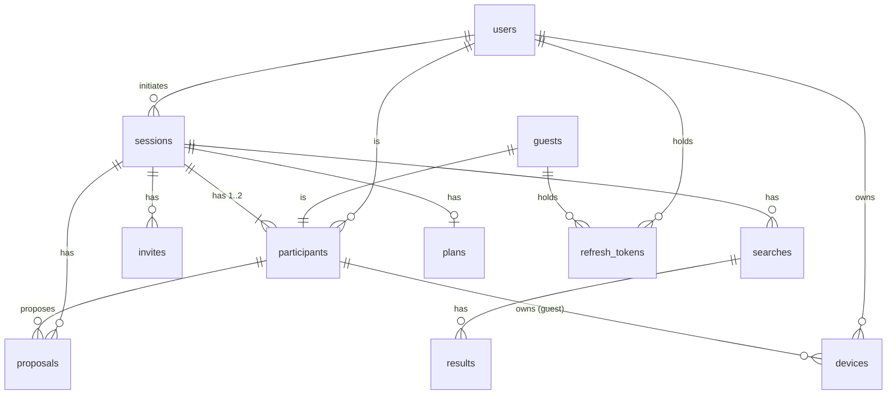

| Table | Key columns | Constraints and indexes |
|---|---|---|
| `users` | `id`, `idp_provider`, `idp_subject`, `display_name`, `color`, `email?`, `created_at` | unique (`idp_provider`, `idp_subject`) |
| `guests` | `id`, `session_id`, `display_name`, `created_at` | FK to `sessions` |
| `sessions` | `id`, `initiator_user_id`, `status`, `meeting_time?`, `created_at`, `expires_at`, `version` | index (`status`, `expires_at`). `version` is incremented on every change and drives the ETag |
| `participants` | `id`, `session_id`, `user_id?`, `guest_id?`, `role`, `mode?`, `origin_ciphertext bytea?`, `approx_lat?`, `approx_lng?`, `area_label?`, `joined_at` | **unique (`session_id`, `role`)** with `role IN ('A','B')`, so a third participant cannot be inserted (FR-SES-02). A check constraint requires exactly one of `user_id`, `guest_id` |
| `invites` | `id`, `session_id`, `secret_hash bytea`, `failed_attempts`, `expires_at`, `redeemed_at?`, `revoked_at?` | partial unique index on (`session_id`) where not redeemed and not revoked: one live invite per session |
| `searches` | `id`, `session_id`, `input_hash bytea`, `filters jsonb`, `status`, `empty_reason?`, `created_at`, `expires_at` | index (`session_id`, `input_hash`, `expires_at`). This lookup is the search cache (section 9.4) |
| `results` | `search_id`, `rank`, `place_id`, `name`, `category`, `price_level`, `open_at_meeting`, `lat`, `lng`, `t_a`, `t_b`, `even`, `score`, `rating?` | PK (`search_id`, `rank`) |
| `proposals` | `id`, `session_id`, `place_id`, `place_name`, `place_lat`, `place_lng`, `proposed_by`, `status`, `created_at` | **partial unique index on (`session_id`) where `status = 'active'`** (FR-RES-03) |
| `plans` | `session_id` (PK), `place_id`, `place_name`, `place_lat?`, `place_lng?`, `meeting_time`, `confirmed_at` | |
| `devices` | `id`, `user_id?`, `participant_id?`, `platform`, `push_token`, `prefs jsonb`, `created_at` | unique (`platform`, `push_token`) |
| `refresh_tokens` | `id`, `family_id`, `subject_type`, `subject_id`, `token_hash bytea`, `dpop_jkt?`, `expires_at`, `family_expires_at`, `used_at?`, `revoked_at?` | unique (`token_hash`); index (`family_id`); index (`subject_id`) |
| `idempotency_keys` | `subject_id`, `key`, `request_hash`, `status_code`, `response_body jsonb`, `created_at` | PK (`subject_id`, `key`) |
| `outbox` | `id`, `event_type`, `payload jsonb`, `created_at`, `sent_at?` | partial index on unsent rows |
| `audit_events` | Not in PostgreSQL. Security events go to a dedicated CloudWatch Logs group (section 11.6) | |

Rules enforced in SQL rather than only in code:

- **Single-use invite** (FR-SES-03): `UPDATE invites SET redeemed_at = now() WHERE id = $1 AND redeemed_at IS NULL AND revoked_at IS NULL AND expires_at > now() RETURNING ...`, run in the same transaction as the participant insert. Two concurrent redemptions cannot both succeed.
- **Refresh rotation** (SEC-AUTH-05): `UPDATE refresh_tokens SET used_at = now() WHERE token_hash = $1 AND used_at IS NULL AND revoked_at IS NULL AND expires_at > now() RETURNING ...`. If no row comes back but the hash exists with `used_at` set, the token is being reused. The API then revokes the whole family and logs a `token_reuse` security event.
- **Accept only by the other participant** (FR-RES-04): the accept transaction locks the proposal with `SELECT ... FOR UPDATE`, checks `proposed_by <> caller`, sets `status = 'accepted'`, inserts the plan, updates the session, and writes the outbox event.

### 7.3 Redis usage

Redis holds only disposable state. Losing it degrades rate limiting and replay protection for a short window but loses no user data.

| Key pattern | Purpose | TTL |
|---|---|---|
| `rl:{scope}:{id}` | Token-bucket rate limits (SEC-RL-01 to 04) | Window length |
| `dpop:jti:{jkt}:{jti}` | DPoP proof replay cache | 5 min |
| `deny:sub:{subjectId}` | Subjects whose access tokens must fail immediately (deletion, family revocation) | 15 min (the access token lifetime) |
| `budget:{provider}:{day}`, `budget:user:{id}:{day}` | Provider call budgets (NFR-COST-02) | 48 h |
| `ac:sess:{hash}` | Autocomplete billing session token mapping | 3 min |

Keys never contain coordinates or addresses. The Redis endpoint is reachable only from the app security group, requires TLS, and uses IAM authentication.

### 7.4 Idempotency (API-05)

For `POST` endpoints that create resources, the `Idempotency-Key` header is stored together with a SHA-256 hash of the request body and the caller's subject, in the **same transaction** as the created resource. The outcomes are:

- The same key with the same body returns the stored status and body.
- The same key with a different body returns `422`.
- A key that is still in flight returns `409`.

Keys expire after 24 hours. Stored response bodies never contain precise origins: origins are only ever set by `PUT`, and no `POST` response echoes them.

### 7.5 Location data handling (PRIV-03, PRIV-04)

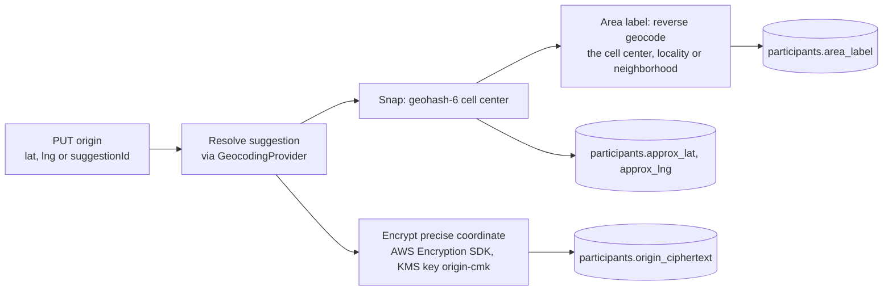

- The precise coordinate is encrypted with the **AWS Encryption SDK for JavaScript**, using a KMS keyring on a dedicated customer managed key, `origin-cmk`. That key is separate from the Aurora storage key (PRIV-04). The encryption context `{ purpose: "origin", sessionId, participantId }` binds each ciphertext to its row, so a ciphertext copied into another row will not decrypt. A local data key cache (5 minutes maximum, bounded message count) keeps KMS call volume manageable at scale.
- Only the api service's task role has `kms:Decrypt` on `origin-cmk`, and only with a matching `purpose` encryption context. The worker never decrypts origins; it purges them by setting the columns to `NULL`.
- Decryption happens in exactly two places: running a search, and returning the caller's **own** origin in `GET /v1/sessions/{id}`.
- The area label is reverse-geocoded from the **cell center**, not the precise point, so the label cannot carry more precision than the cell.
- The serializer for the other participant has no field that could hold a precise coordinate or address (API-SHP-01). The property test in PRIV-03 runs against this serializer.

---

## 8. Key flows

### 8.1 Sign-in and token refresh

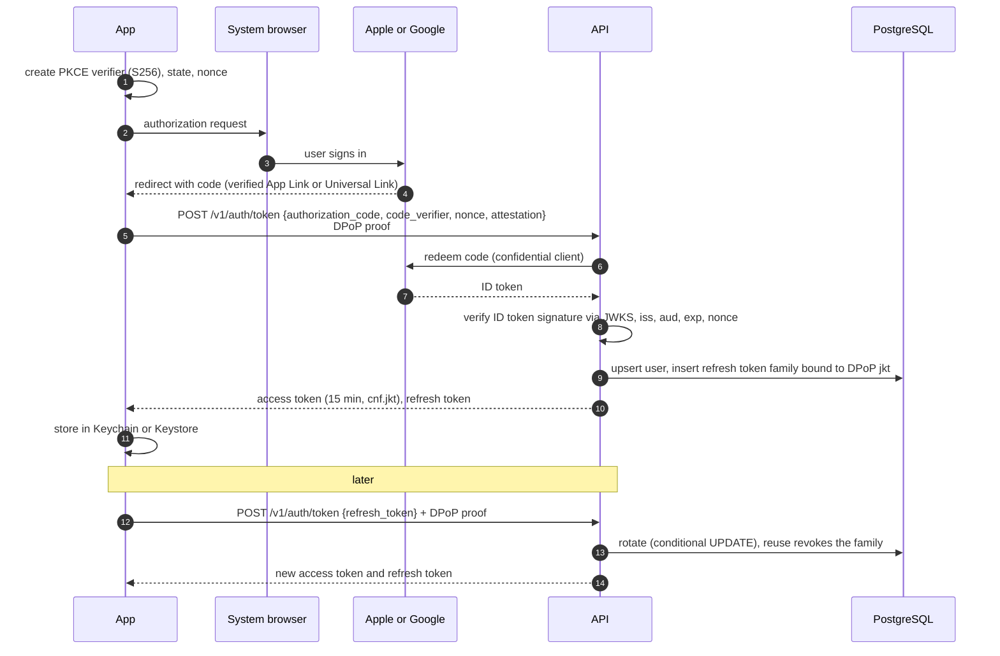

The API redeems the authorization code **itself**, acting as a confidential client of each IdP. Apple requires a client-secret JWT for token redemption, which cannot live in the app. Doing the same for Google gives one uniform flow. The app never sends IdP tokens to the API for ongoing authorization (SEC-AUTH-03). On iOS, Sign in with Apple uses `AuthenticationServices` natively and sends the returned authorization code through the same endpoint. For Android Apple sign-in, see AQ-01.

### 8.2 Create session, invite, and redeem

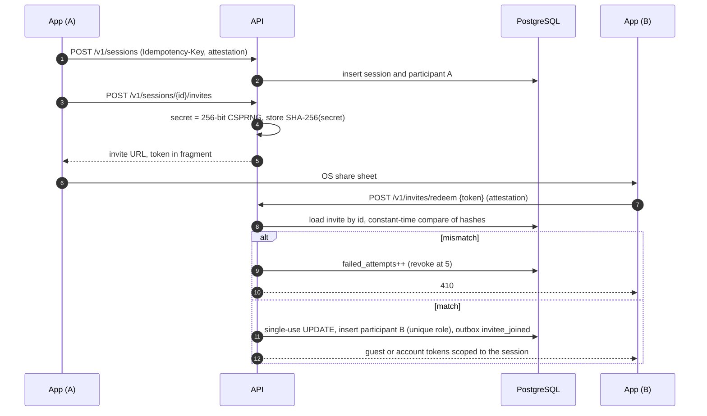

Putting the invite ID in the token lets SEC-RL-02's "5 failures per session" be enforced per invite, because a failed guess still identifies which invite it was aimed at. The constant-time comparison (SEC-INV-02) is over the hash of the secret part only.

### 8.3 Set a starting point

`PUT .../participants/me/origin`: the route resolves the participant from the token subject, never from the path (FR-ORG-05). The handler validates, resolves, snaps, labels, and encrypts (section 7.5). It then marks any unexpired searches for the session as stale (FR-ORG-06), increments `sessions.version`, and commits.

### 8.4 Search

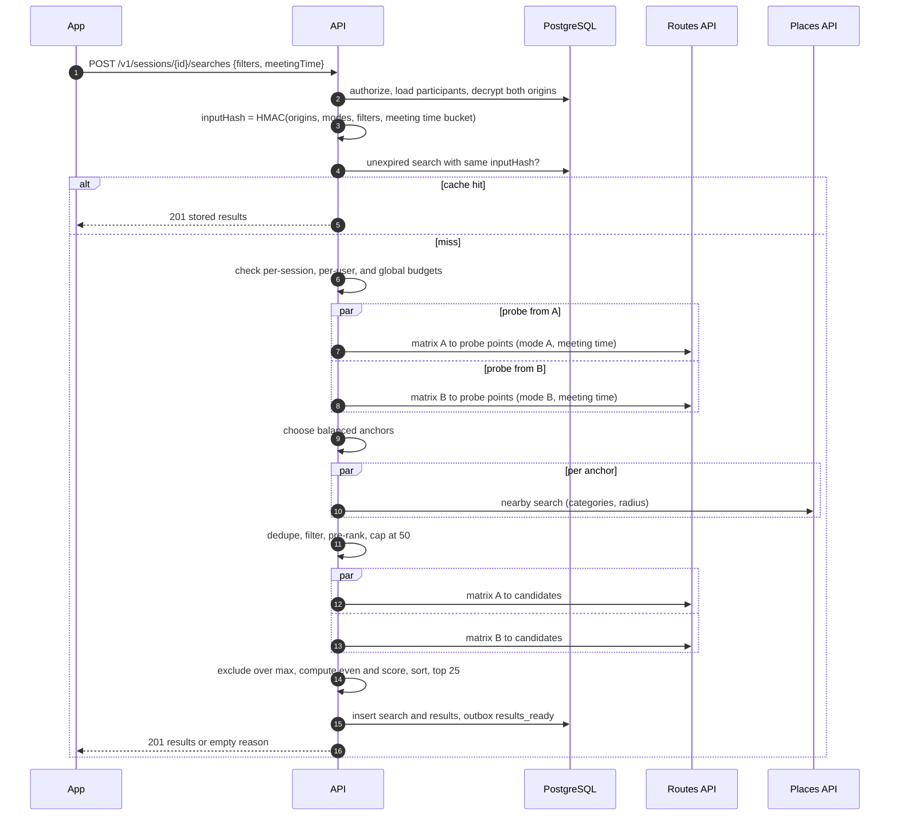

The algorithm is described in section 9.

### 8.5 Propose, accept, and notify

`POST .../proposals` withdraws any active proposal and inserts the new one, which the partial unique index guarantees is the only active proposal. It also writes `proposal_received` to the outbox. `POST .../accept` runs the locked transaction in section 7.2 and writes `plan_confirmed`. The worker delivers both pushes. Directions deep links are built on the device from the Plan's place coordinate only (FR-RES-06).

### 8.6 Account deletion (FR-ACC-04)

Done synchronously in `DELETE /v1/me`, inside one transaction:

1. Revoke every refresh token family for the user, and set `deny:sub:{userId}` in Redis so outstanding access tokens fail right away.
2. Remove the user from open sessions, the same as leaving (FR-SES-05). This nulls their origins and ends sessions they initiated.
3. Delete devices, plans, and the user row. Rows that must survive for the other participant are re-keyed to a tombstone with no personal data.
4. Write the `account_deletion` security event.

Then asynchronously, on the `account-deletion` queue: confirm that nothing refers to the user, and check provider-side data (there is none; the API sends no user identifiers to providers). Backups age out within 30 days.

---

## 9. Candidate generation and ranking (FR-SRCH-04 to FR-SRCH-10)

This section is the method FR-SRCH-04 requires `ARCHITECTURE.md` to document.

### 9.1 Why not the midpoint

The geographic midpoint ignores mode and network. With mixed modes (A drives, B takes transit), the balanced region can sit well toward one person. It can also sit off the straight line between them, for example along a rail line. The method below finds the region where travel times balance, using the same matrix provider that produces `tA` and `tB`.

### 9.2 Algorithm

Inputs: origins `A` and `B`, modes `mA` and `mB`, meeting time `T`, filters, and per-person maximum `Tmax`.

1. **Probe grid.** Build probe points around the segment from A to B: 5 fractions along it (0.2, 0.35, 0.5, 0.65, 0.8), each at 3 perpendicular offsets (−d/4, 0, +d/4), where `d` is the A–B distance. That is 15 probes. When `d` is under 1.5 km, skip probing and use the midpoint as the only anchor.
2. **Probe matrix.** Make two parallel 1×15 matrix calls, A to the probes in mode `mA` and B to the probes in mode `mB`, departing at `T` (FR-SRCH-03).
3. **Choose anchors.** Discard probes where `tA > Tmax` or `tB > Tmax`. If none remain, return an empty result with reason `no_overlap` (FR-SRCH-10). Otherwise rank the remaining probes by the FR-SRCH-07 score and keep up to 3 anchors that are at least `d/6` apart. This spreads coverage across the balanced region instead of clustering it.
4. **Place search.** Run one Places nearby search per anchor, in parallel, with the selected categories and a radius of `clamp(d/5, 800 m, 5 km)`. Filter by open at `T` and price level. If nothing survives the filters but places existed before filtering, the reason is `filters_too_narrow`.
5. **Candidate cap.** Deduplicate by place ID. Pre-rank by the interpolated score of the nearest anchor, then by provider rating, and keep at most `MAX_CANDIDATES` (50; NFR-COST-01).
6. **Final matrix.** Make two parallel 1×N calls, A and B to the candidates, each with its own mode and `T` (FR-SRCH-05).
7. **Rank.** Exclude candidates over `Tmax` (FR-SRCH-08). Compute `even` (FR-SRCH-06) and `score = max(tA, tB) + W * abs(tA - tB)` (FR-SRCH-07). Sort by score, then rating (descending), then place ID. Return the top 25 (FR-SRCH-09).

`FAIRNESS_RATIO`, `FAIRNESS_FLOOR_SECONDS`, `W`, `MAX_CANDIDATES`, the probe layout, and the radius bounds are read from SSM Parameter Store, so they can be tuned without a deploy (OD-05).

### 9.3 Latency and cost budget

| Stage | Provider calls | Expected latency |
|---|---|---|
| Probe matrix | 2 in parallel, 15 elements each | 0.4 to 0.9 s |
| Place search | Up to 3 in parallel | 0.3 to 0.7 s |
| Final matrix | 2 in parallel, up to 50 elements each | 0.5 to 1.2 s |
| Compute and store | none | under 50 ms |
| **Total** | 7 calls | about 1.2 to 2.8 s. Target p50 under 2 s, p95 under 4 s (NFR-PERF-01) |

The whole search has an 8-second deadline. When the routing provider fails or times out, the search returns `provider_unavailable` right away. There is no straight-line fallback (NFR-AV-02). One origin per matrix request keeps every call within the Routes API element limits, including the lower limit for transit.

### 9.4 Caching (FR-SRCH-11)

`inputHash = HMAC-SHA256(k_search, canonical(originA, originB, modeA, modeB, filters, T rounded down to 5 min))`. The key `k_search` comes from Secrets Manager. The HMAC means a logged or leaked hash cannot be brute-forced back to coordinates. A search row with the same `(session_id, input_hash)` that has not expired (15 minutes) is returned as-is. Origin changes produce a new hash, which invalidates the old results (FR-ORG-06). A cached result costs no provider calls and does not count toward the search rate limit (SEC-RL-03).

---

## 10. Integrations

### 10.1 Provider interfaces (INT-03)

```ts
interface RoutingProvider {
  matrix(origin: LatLng, destinations: LatLng[], mode: TravelMode, departAt: Date,
         signal: AbortSignal): Promise<Array<{ seconds: number } | { unreachable: true }>>;
}
interface PlacesProvider {
  nearby(center: LatLng, radiusM: number, q: PlaceQuery, signal: AbortSignal): Promise<Place[]>;
}
interface GeocodingProvider {
  autocomplete(query: string, sessionToken: string, bias?: LatLng): Promise<Suggestion[]>;
  resolve(suggestionId: string, sessionToken: string): Promise<LatLng>;
  areaLabel(cellCenter: LatLng): Promise<string>;
}
```

Adapters validate every provider response against a Zod schema before use. Malformed responses are dropped and logged by shape only, never by content. Provider URLs are passed through only if they are `https` (SEC-SEC-03). Unit tests use recorded fixtures behind these interfaces (QA-03).

### 10.2 Provider selection (proposed resolution of OD-02 and OD-03)

AD-10: Use **Google Maps Platform**: the Routes API (Compute Route Matrix), Places API (New) nearby search and autocomplete, and the Geocoding API. It is the only candidate in INT-01 and INT-02 that covers drive, **transit**, walk, and bike matrices with departure time, **and** place categories with opening hours and price level, from a single managed vendor. Self-hosting Valhalla or OSRM plus OpenTripPlanner would mean running GTFS ingestion for every metro area, which the "nothing exotic" constraint argues against. Transit ships in v1, subject to Product confirming the cost from the budget model (OD-02).

Consequences:

- The Google terms require Google Places content to be displayed on a Google map, so the app uses the Google Maps SDK on iOS as well as Android (section 4.3).
- Server keys are restricted by API and by the NAT gateway egress IPs. App display keys are restricted by bundle ID, package name, and signing certificate fingerprint, with quotas set (SEC-SEC-02).

### 10.3 Provider data retention (NFR-COST-03)

**Status: UNCONFIRMED. Legal must review before M4 (OD-03).** The values below reflect Engineering's reading of the Google Maps Platform terms and are the most conservative design that still works.

| Data | Where held | Retention in this design |
|---|---|---|
| Place ID | `results`, `proposals`, `plans` | Allowed to be kept indefinitely. Deleted with the owning row |
| Place latitude and longitude | `results`, `proposals`, `plans` | At most 30 days. The daily job nulls `plans.place_lat/lng` after 30 days |
| Place name, category, price, hours, rating | `results` | 15 minutes (the search lifetime) |
| Place name on Plan | `plans.place_name` | Kept until account deletion (section 6.3 of `REQUIREMENTS.md`). **Needs Legal sign-off.** The alternative is to store only the place ID and re-fetch the name on view |
| Travel times | `results` | 15 minutes |
| Autocomplete suggestions | not stored | Returned directly to the client |

Cross-session provider caching, such as reusing place searches for the same area, is **disabled** until Legal confirms it is allowed.

### 10.4 Other integrations

| Integration | Mechanism | Credentials |
|---|---|---|
| Sign in with Apple | Code redemption with a client-secret JWT signed by the Apple key; ID token checked against Apple's JWKS | `.p8` key in Secrets Manager |
| Google Identity | OIDC code redemption; ID token checked against Google's JWKS | Client secret in Secrets Manager |
| APNs | HTTP/2, token-based authentication (INT-04) | `.p8` key in Secrets Manager |
| FCM | HTTP v1 API with an OAuth2 service account (INT-04) | Service account JSON in Secrets Manager |
| App Attest | Attestation and assertion verification in the API (SEC-RL-05) | Apple root CA pinned in code |
| Play Integrity | Server-side token decode through the Google Play Integrity API (SEC-RL-05) | Service account in Secrets Manager |

---

## 11. Security architecture

`SECURITY.md` holds the threat model (QA-09) and the security policy. This section describes the structure it analyzes.

### 11.1 Trust boundaries

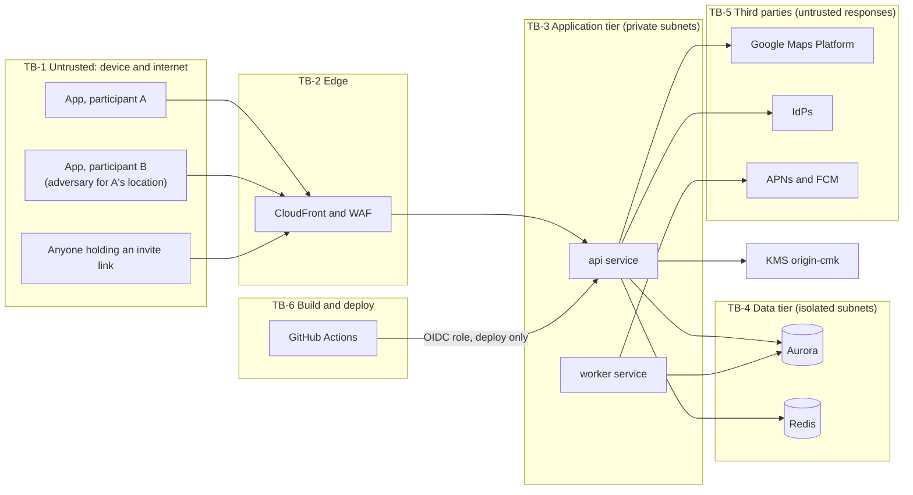

| Boundary | What crosses it | Controls |
|---|---|---|
| TB-1 to TB-2 | Every client request, including requests from a malicious app or a scripted client | TLS 1.2+ with a TLS 1.3 preference and HSTS (SEC-TLS-01). WAF managed rules and rate-based rules. Shield Standard |
| TB-2 to TB-3 | Filtered requests | The ALB accepts only the CloudFront origin-facing managed prefix list plus a secret origin header, which is rotated. TLS runs from CloudFront to the ALB |
| **Participant to participant** | Session state about the other person | The other participant is treated as an adversary for location. Snapping (PRIV-03), the allowlist serializer (API-SHP-01), write paths scoped to `me` (FR-ORG-05), rounded times (AD-17), and search rate limits (SEC-RL-03) |
| TB-3 to TB-4 | SQL, cache operations | IAM authentication, TLS, security groups that allow only the app tier, parameterized queries |
| TB-3 to TB-5 | Origins and candidate coordinates going out; place data coming back | Egress only through NAT. Keys from Secrets Manager. Responses schema-validated. Only coordinates are sent to providers, never user identifiers |
| TB-6 to AWS | Images and infrastructure changes | GitHub OIDC federation to per-environment deploy roles. No long-lived AWS keys. Production deploys require protected branches and an approval |

### 11.2 Data classification

| Class | Examples | Handling |
|---|---|---|
| Restricted | Precise origins, addresses, autocomplete query text | Encrypted at the application level (origins). Never logged (PRIV-05). Purged on session end |
| Secret | Refresh tokens, invite secrets, provider keys, signing keys | Stored only as hashes (tokens, invite secrets) or in Secrets Manager (keys). Redacted from logs |
| Confidential | Display name, email, IdP subject, snapped area, Plan | Encryption at rest. Access controlled by authorization. Included in export |
| Internal | Metrics, trace timing, correlation IDs | No personal data in labels |

### 11.3 Authentication and tokens

| Item | Design |
|---|---|
| Access token | JWT signed with ES256. Claims: `iss`, `aud=api.<domain>`, `sub`, `sub_type` (`account` or `guest`), `sid` (guest only), `cnf.jkt`, `iat`, `exp` (at most 15 minutes), `jti` (SEC-AUTH-04) |
| Signing keys | P-256 key pair in Secrets Manager, loaded into memory at startup, rotated every 90 days with an overlap of two `kid`s. KMS asymmetric signing was rejected because its request quotas are too low for the refresh volume at scale |
| Refresh token | 256-bit opaque random value, stored as SHA-256. Rotated on every use, with family revocation on reuse (SEC-AUTH-05). Absolute lifetime is 30 days for accounts and the session lifetime for guests (SEC-AUTH-07) |
| Client refresh discipline | The token manager single-flights refreshes. A legitimate client therefore never presents the same refresh token twice, and a reuse is always treated as theft |
| Sign-out | `POST /v1/auth/revoke` revokes the family. The app deletes its credentials and the DPoP key (SEC-AUTH-08) |
| Guest credentials | Issued at redemption, with `sub_type=guest` and `sid` set. The authorization layer rejects guests on every `/v1/me` route (SEC-AZ-03) |
| Guest upgrade (FR-ACC-03) | `grant_type=guest_upgrade` requires both a valid guest access token and an IdP authorization code. In one transaction, the participant row is re-pointed from `guest_id` to `user_id`, the guest row is deleted, and the guest token family is revoked |
| Immediate revocation | `deny:sub:{id}` in Redis is checked on every request. It is set on account deletion and on family revocation for 15 minutes |

### 11.4 DPoP (SEC-AUTH-06)

AD-14 (proposed resolution of OD-04): **Ship DPoP in v1.** The `halfsies-device-security` module creates a non-exportable P-256 key on first sign-in, in the Secure Enclave on iOS and in StrongBox or the TEE on Android. Every request carries a DPoP proof (`htm`, `htu`, `iat`, `jti`, and `ath` for resource requests). The API checks the signature, compares `jkt` with `cnf.jkt`, requires `iat` within ±60 seconds, and rejects a repeated `jti` using Redis. Refresh tokens are bound to the `jkt` at issuance. If the hardware keystore is missing on an older Android device, the module falls back to a software Keystore key, and `SECURITY.md` records that as a residual risk.

### 11.5 Edge and network protections

- **AWS WAF** on CloudFront: AWS managed core and known-bad-inputs rule sets, and rate-based rules per IP (a coarse limit globally, a tighter one on `/v1/invites/redeem` and `/v1/auth/*`). WAF logs **redact the query string and the `authorization` and `dpop` headers**.
- **CloudFront** standard logging (v2) is configured with a field allowlist that **excludes the query string**, because `GET /v1/places/autocomplete?q=` carries address text (PRIV-05). **ALB access logs are disabled** for the same reason: their format cannot leave out the query string. Request logging happens in the application, where redaction is under our control. See AQ-02.
- Certificate pinning (SEC-TLS-03) is **not** implemented in v1. DPoP binding, App Attest, and ATS or Network Security Config already cover most of the threat pinning addresses, and pinning adds the risk of an outage when certificates rotate. `SECURITY.md` records this decision.

### 11.6 Logging and redaction (PRIV-05, SEC-LOG-01 to 03)

- `pino` redaction paths remove `req.headers.authorization`, `req.headers.dpop`, `req.headers.cookie`, `req.query.q`, and every body field.
- A final log serializer applies pattern scrubbing to catch leaks the paths miss. It masks decimal coordinate pairs, the invite token format, and JWT-shaped strings.
- Request logs record route **templates** (`/v1/sessions/:sessionId`), not raw URLs.
- OpenTelemetry spans carry no attributes with request parameters. The HTTP instrumentation is configured to drop `url.query` and provider request bodies.
- Security events (the SEC-LOG-01 list) go to a dedicated CloudWatch Logs group, `halfsies-security`, with **1-year retention** (section 6.3). Application logs keep 30 days.
- CloudWatch metric filters and alarms cover refresh token reuse, spikes in authorization failures, and invite brute-force patterns (SEC-LOG-03). Alarms go to the on-call rotation through SNS.
- The PRIV-05 acceptance test runs a full session flow against the staging stack with known coordinates and searches the captured CloudWatch, X-Ray, WAF, CloudFront, and Sentry output for them.

### 11.7 Key and secret management

| Key or secret | Store | Rotation |
|---|---|---|
| `origin-cmk` | KMS customer managed key | Automatic annual rotation |
| Aurora, Redis, S3, SQS, and log encryption | KMS customer managed keys, one per data class | Automatic annual rotation |
| JWT signing key, `k_search`, origin header secret | Secrets Manager | 90 days |
| Provider, IdP, APNs, and FCM credentials | Secrets Manager (SEC-SEC-01) | According to each provider |
| Runtime tunables (fairness constants, minimum app versions, limits) | SSM Parameter Store | On change |

### 11.8 Travel-time rounding (PRIV-06)

AD-17 (proposed resolution of OD-06): the serializer rounds **both** `tA` and `tB` to the nearest 60 seconds in every response. Ranking and the `even` flag are computed on unrounded values before serialization. Together with the 20-searches-per-hour limit, this bounds how precisely one participant can trilaterate the other's origin across searches. The residual risk is recorded in the threat model.

---

## 12. AWS infrastructure

### 12.1 Accounts and environments

AWS Organizations with separate accounts: `security` (log archive, GuardDuty and Security Hub delegated admin), `shared` (ECR, CI roles), `dev`, `staging`, and `prod`. Service control policies deny disabling CloudTrail, deny leaving the organization, and deny regions outside the approved list. Staging mirrors production at a smaller size and is where DAST runs (QA-06).

### 12.2 Deployment view (production)

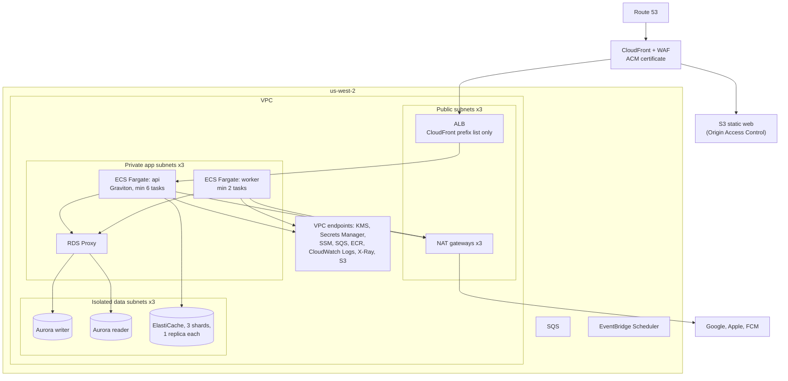

- **Compute.** ECS on Fargate, ARM64 (Graviton). No servers or cluster nodes to patch. Tasks run as non-root with read-only root filesystems.
- **Scaling.** The api service uses target tracking on ALB requests per target and on CPU, spread across 3 AZs. The worker scales on SQS queue depth. Aurora readers use Aurora auto scaling. ElastiCache runs in cluster mode and can add shards.
- **Egress.** All outbound internet traffic goes through NAT gateways with fixed Elastic IPs. The Google server keys are restricted to those IPs.

AD-08: ECS Fargate was chosen over EKS. The system is two services with no need for Kubernetes features. Fargate removes node management, and ECS integrates directly with ALB, IAM task roles, and Secrets Manager.

AD-09: CloudFront sits in front of the API even though the API responses are not cached. It gives edge TLS termination close to users, WAF and Shield at the edge, one distribution for both `api.<domain>` and the static `<domain>` content, and a stable place to apply logging controls.

### 12.3 Infrastructure as code

AD-11: **Terraform**, with one root module per environment and shared modules for the network, data, services, and edge. State is kept in S3 with DynamoDB locking in the `shared` account. Changes are applied only by CI after `plan` output has been reviewed on the PR. Checkov scans the Terraform in CI.

### 12.4 Availability and disaster recovery

| Aspect | Design |
|---|---|
| AZ failure | Every tier runs in 3 AZs. Aurora fails over automatically. The ALB and ECS rebalance |
| SLO | 99.5% monthly (NFR-AV-01), which allows about 3.6 hours of downtime a month. Single-region Multi-AZ meets this |
| RPO and RTO for a regional outage | RPO 1 hour, RTO 8 hours. Aurora snapshots are copied hourly to `us-east-2`. The Terraform can build the stack there. The DNS failover is a runbook step, not automatic |
| Backups | 30-day retention (section 6.3), encrypted, restores tested quarterly |
| Deploys | ECS rolling deployment with the deployment circuit breaker and automatic rollback. Migrations must stay backward compatible with the previous release (expand, then contract) |

AD-20 (proposed resolution of OD-07): the primary region is **`us-west-2`**, with `us-east-2` for DR copies. v1 is US-only (NFR-L10N-01, PRIV-10). Both regions offer every service used here. An EU launch needs an EU region deployment for GDPR data residency, which is out of scope for v1.

---

## 13. Observability (OBS-01 to OBS-03)

| Signal | Tooling | Contents |
|---|---|---|
| Traces | OpenTelemetry, ADOT collector, X-Ray | A span per request, per provider call, and per database transaction. The correlation ID is returned in `X-Correlation-Id` |
| Metrics | CloudWatch (embedded metric format from the app) | Search latency p50 and p95, provider latency and error rate per provider and operation, cache hit rate, provider spend per day, even-trip rate, empty-result rate by reason, rate-limit triggers, queue depth (OBS-02) |
| Logs | CloudWatch Logs | Application logs (30 days) and security logs (1 year) |
| Crashes | Sentry | Mobile crashes and JS errors, scrubbed (OBS-03) |
| Dashboards and SLOs | CloudWatch dashboards; CloudWatch Application Signals SLOs | Availability SLO, latency SLOs from NFR-PERF |
| Alerts | CloudWatch alarms to SNS to the on-call tool | SLO burn rate, provider error spikes, budget at 80% (NFR-COST-02), security alarms (SEC-LOG-03), dead-letter queue depth |

Metric dimensions are limited to route template, provider, operation, mode, and outcome. There are no user, session, or location dimensions.

---

## 14. Build, test, and release

### 14.1 Repository layout

```
/apps/mobile                 React Native app (Expo modules, prebuild)
/apps/mobile/modules/halfsies-device-security   in-house native module
/services/api                API and worker (two entry points)
/packages/api-contract       openapi.yaml, generated types and client
/packages/domain             shared pure TypeScript (enums, constants)
/infra                       Terraform
/web                         static .well-known, legal pages, invite fallback
```

npm workspaces, with one lockfile at the root (SEC-SC-02).

### 14.2 CI pipeline (GitHub Actions)

| Stage | Tools | Gate |
|---|---|---|
| Lint and types | ESLint, `tsc --noEmit`, module boundary rules | Block |
| Unit tests with coverage | Vitest (API), Jest with React Native Testing Library (app). 80% minimum (QA-01). Requirement IDs appear in test names (QA-02) | Block |
| Contract | OpenAPI lint (Spectral), generated-code drift check, Schemathesis against an ephemeral API with PostgreSQL and Redis (QA-04) | Block |
| SAST | CodeQL | Block on high |
| SCA | Dependabot, OSV-Scanner | Block on critical or high without a documented exception (SEC-SC-02) |
| Secrets | GitHub secret scanning with push protection, and gitleaks (SEC-SEC-04) | Block |
| IaC | `terraform validate`, Checkov | Block |
| Container | ECR enhanced scanning (Inspector) | Block on critical |
| SBOM | CycloneDX, via `cdxgen`, for the API image and both app builds (SEC-SC-03) | Artifact |
| E2E (app) | Maestro flows on iOS simulators and Android emulators, including the "Who can see what" check (PRIV-08) | Block on `main` |
| DAST | OWASP ZAP API scan and the BOLA suite against staging (QA-06) | Block release |

### 14.3 Release

- **API:** merge to `main`, build the image, push to ECR (immutable tags), deploy to staging, run smoke and DAST, get manual approval, then deploy to production.
- **Apps:** release branches are protected. macOS runners run `expo prebuild` and fastlane. Uploads go to TestFlight and the Play internal track. Signing uses App Store Connect managed signing and Play App Signing. The upload keys live in Secrets Manager, fetched through OIDC (SEC-SC-04). Release builds disable dev menus, debuggable flags, and debug logging (SEC-MOB-04).
- The API keeps at least the two most recent app versions working (API-02). `/v2` is introduced only for breaking changes.

---

## 15. Technology choices summary

| Area | Choice | Main alternatives considered | Why |
|---|---|---|---|
| Mobile framework | React Native + TypeScript, Expo modules with prebuild | Native Swift and Kotlin; Flutter | Fixed constraint. One codebase, native views, a large ecosystem |
| API runtime | Node.js 24 LTS | none | Fixed constraint |
| HTTP framework | Fastify | Express, NestJS | Schema-driven validation and serialization map directly onto the OpenAPI-first contract. Faster than Express. Less framework weight than NestJS |
| Database | Aurora PostgreSQL + RDS Proxy | RDS for PostgreSQL | Fixed engine. Aurora has faster failover and easier read scaling at this size |
| Query layer | Kysely on `pg` | Prisma, TypeORM | Type-safe SQL that is always parameterized, with full control over locking and conditional updates |
| Cache and counters | ElastiCache (Redis OSS) | DynamoDB | Atomic counters and TTLs at sub-millisecond latency for rate limiting and replay caches |
| Compute | ECS Fargate (Graviton) | EKS, Lambda | Long-lived connection pools, steady traffic, and no cluster to run |
| Async | SQS + EventBridge Scheduler + outbox | Kafka, Kinesis | Enough for the event volume. Fully managed |
| Edge | CloudFront + WAF + Shield Standard | API Gateway | WAF at the edge, one distribution for the API and static content, field-level control over logging |
| Secrets and config | Secrets Manager, SSM Parameter Store | Vault | Native IAM integration |
| Encryption | KMS + AWS Encryption SDK | Vault Transit, pgcrypto | Application-level envelope encryption with a separate key (PRIV-04). Keys never enter the database |
| Maps, routes, places | Google Maps Platform | Mapbox + Foursquare, self-hosted OSRM/Valhalla + OTP | The only single managed vendor covering every mode, including transit, plus place attributes |
| IaC | Terraform | AWS CDK, CloudFormation | Industry standard, reviewable plans |
| CI | GitHub Actions | CodePipeline | The repository is on GitHub. OIDC federation to AWS |
| Observability | OpenTelemetry → CloudWatch and X-Ray; Sentry for mobile crashes | Datadog | AWS-native with vendor-neutral instrumentation. Sentry is the standard for React Native crash reporting |

---

## 16. Requirement traceability (selected)

| Requirement | Where it is implemented |
|---|---|
| PLAT-03 | AD-01, section 4.1 |
| PLAT-05, SEC-SEC-01, 02 | Sections 2, 4.3, 10.2 |
| FR-SES-02, FR-SES-03 | Section 7.2 (unique role, single-use update) |
| FR-ORG-05, SEC-AZ-01 to 04 | Section 5.2, step 7; section 8.3 |
| FR-SRCH-04 to 11 | Section 9 |
| FR-RES-03, FR-RES-04 | Section 7.2 (partial unique index, locked accept) |
| FR-ACC-04 | Section 8.6 |
| API-01, API-04, API-05, API-07 | Sections 5.1, 5.2, 7.4 |
| API-SHP-01 to 03, PRIV-03 | Sections 5.2, step 10; 7.5 |
| PRIV-04 | Section 7.5 |
| PRIV-05, SEC-LOG-01 to 03 | Sections 11.5, 11.6 |
| SEC-AUTH-01 to 08 | Sections 8.1, 11.3, 11.4 |
| SEC-INV-01 to 06 | Sections 4.4, 8.2 |
| SEC-RL-01 to 05 | Sections 5.2, 7.3, 11.5 |
| NFR-PERF-01, 05; NFR-AV-02 | Sections 5.1, 9.3 |
| NFR-PERF-04 | Section 4.7 |
| NFR-COST-01 to 03 | Sections 9.2, 9.3, 10.3 |
| NFR-AV-01 | Section 12.4 |
| NFR-AV-03, SEC-MOB-02, 03 | Section 4.6 |
| QA-01 to 07, SEC-SC-01 to 04 | Section 14 |
| OBS-01 to 03 | Section 13 |

---

## 17. Open architecture questions

| ID | Question | Owner | Needed by |
|---|---|---|---|
| AQ-01 | Sign in with Apple on Android uses Apple's web flow through Custom Tabs, with an `https` App Link redirect and no name or email scopes, so that `response_mode=query` works. Confirm that this flow meets SEC-AUTH-01's PKCE requirement as Apple implements it. If it does not, either drop Apple sign-in on Android or record the exception in `SECURITY.md` | Security, Engineering | M1 |
| AQ-02 | `GET /v1/places/autocomplete` puts address text in the query string, which forces the logging workarounds in section 11.5. Should the contract change this to `POST` with a body before M3? | Engineering | M3 |
| AQ-03 | PRIV-11 allows first-party product analytics, but section 4.2 of `REQUIREMENTS.md` has no events endpoint. Either add `POST /v1/events` (writing to Amazon Data Firehose and S3) or defer analytics past v1 | Product | M5 |
| AQ-04 | Legal confirmation of the retention table in section 10.3, especially `plans.place_name` | Legal | M4 |
| AQ-05 | Final domain names for `<domain>` and `api.<domain>` (these affect the AASA file, `assetlinks.json`, and IdP redirect URIs) | Product | M1 |
| AQ-06 | Provider budget numbers for NFR-COST-02 (per user per day, global per day) | Product, Engineering | M4 |
